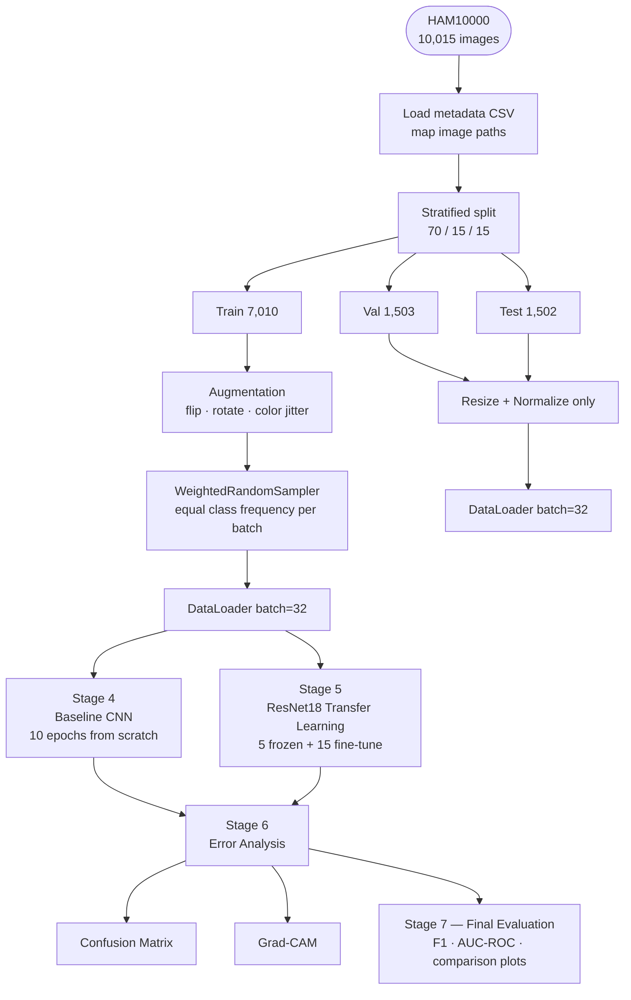
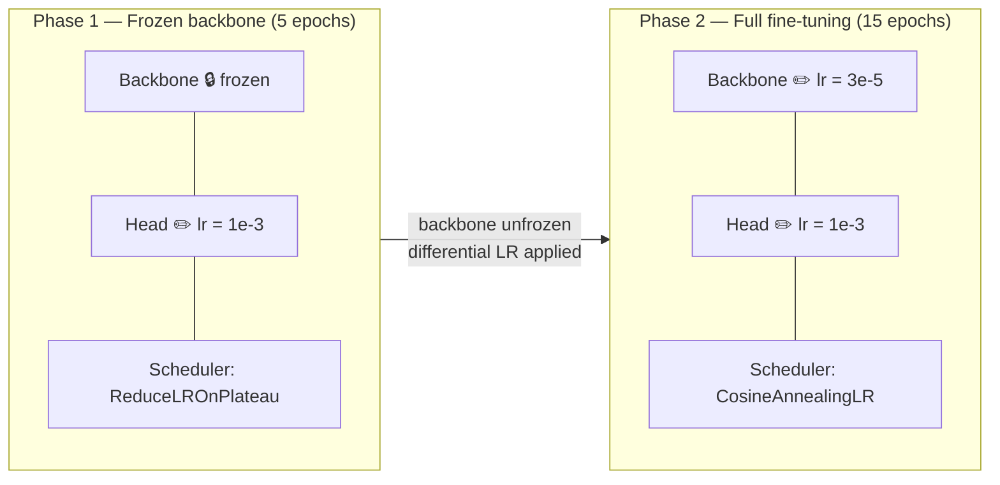
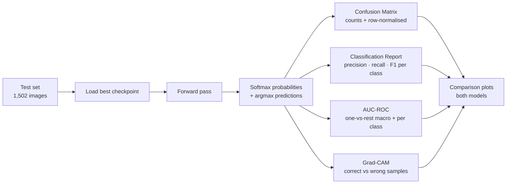
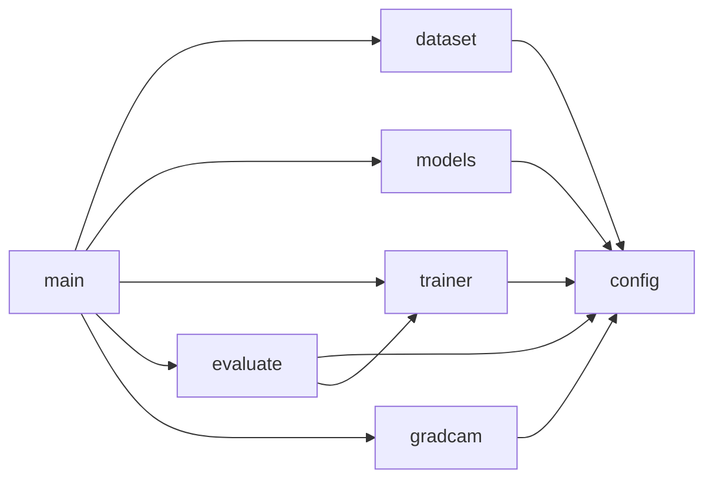

# Skin Lesion Classification — HAM10000

Multi-class dermoscopic image classifier trained on the HAM10000 dataset.  
Compares a **baseline CNN from scratch** against **ResNet18 transfer learning** across 7 skin lesion categories.

---

## Table of Contents
1. [Problem Statement](#1-problem-statement)
2. [Dataset](#2-dataset)
3. [Pipeline Overview](#3-pipeline-overview)
4. [Data Preparation](#4-data-preparation)
5. [Model Architectures](#5-model-architectures)
6. [Training Strategy](#6-training-strategy)
7. [Evaluation](#7-evaluation)
8. [Generated Plots](#8-generated-plots)
9. [Project Structure](#9-project-structure)
10. [Setup & Usage](#10-setup--usage)
11. [Configuration](#11-configuration)
12. [Results](#12-results)

---

## 1. Problem Statement

Dermatologists visually classify skin lesions — a task that is tedious, error-prone, and highly expert-dependent.  
This project builds an automated classifier that assigns one of **7 diagnostic categories** to a dermoscopic image.

**Type of learning:** Supervised multi-class classification. Every image has a confirmed ground-truth label from histopathology, clinical follow-up, or expert consensus.

**Key challenge:** Severe class imbalance — *Melanocytic nevus* accounts for ~67% of all samples. A naive model that always predicts "nevus" reaches ~67% accuracy while being clinically useless.

| Category | Code | Type |
|----------|------|------|
| Actinic keratosis | `akiec` | Pre-cancerous |
| Basal cell carcinoma | `bcc` | Malignant |
| Benign keratosis | `bkl` | Benign |
| Dermatofibroma | `df` | Benign |
| Melanoma | `mel` | Malignant |
| Melanocytic nevus | `nv` | Benign |
| Vascular lesion | `vasc` | Benign |

---

## 2. Dataset

**HAM10000** ("Human Against Machine with 10,000 training images")  
Source: [Kaggle — kmader/skin-cancer-mnist-ham10000](https://www.kaggle.com/datasets/kmader/skin-cancer-mnist-ham10000)

| Property | Value |
|----------|-------|
| Total images | 10,015 |
| Original size | 450 × 600 px |
| Input size (model) | 224 × 224 px |
| Classes | 7 |
| Collection period | 20 years |
| Sources | Medical University of Vienna + Queensland clinic |

### Metadata fields

| Column | Description |
|--------|-------------|
| `image_id` | Unique ID — matches the image filename |
| `dx` | Ground truth diagnosis (class code) |
| `dx_type` | Confirmation: `histo`, `follow_up`, `consensus`, `confocal` |
| `age` | Patient age in years (may be `NaN`) |
| `sex` | `male`, `female`, or `unknown` |
| `localization` | Body location (back, face, trunk, …) |

### Class imbalance

```
melanocytic nevus  ██████████████████████████████████  6705  (66.9%)
melanoma           ████████                            1113  (11.1%)
benign keratosis   ████████                            1099  (11.0%)
basal cell carc.   ████                                 514  ( 5.1%)
actinic keratosis  ██                                   327  ( 3.3%)
vascular lesion    █                                    142  ( 1.4%)
dermatofibroma     █                                    115  ( 1.1%)
```

### Data split

```
10,015 images
    │
    ├── Train  7,010  (70%) ──── WeightedRandomSampler
    ├── Val    1,503  (15%) ──── stratified, no augmentation
    └── Test   1,502  (15%) ──── stratified, never seen during training
```

---

## 3. Pipeline Overview



---

## 4. Data Preparation

### Transforms

| Transform | Train | Val / Test | Rationale |
|-----------|:-----:|:----------:|-----------|
| `Resize(224×224)` | ✅ | ✅ | Required input size for ResNet18 |
| `RandomHorizontalFlip` | ✅ | ❌ | Lesions have no natural orientation |
| `RandomVerticalFlip` | ✅ | ❌ | Same |
| `RandomRotation(±20°)` | ✅ | ❌ | Rotation-invariant appearance |
| `ColorJitter(b=0.2, c=0.2, s=0.2, h=0.1)` | ✅ | ❌ | Camera & lighting variation across clinics |
| `ToTensor` | ✅ | ✅ | PIL → float tensor [0, 1] |
| `Normalize(ImageNet µ/σ)` | ✅ | ✅ | Matches pretrained backbone's expected input |

### WeightedRandomSampler

```python
# weight[i] = 1 / count(class[i])
# sampler draws len(train) samples per epoch with replacement
```

Each class gets equal expected presence in every batch, without duplicating images on disk.

---

## 5. Model Architectures

### 5.1 Baseline CNN

Trained from scratch — establishes a performance lower bound with no pretrained knowledge.

```
Input  3 × 224 × 224
  │
  ├─ Conv(3→32,  3×3) + BN + ReLU + MaxPool(2)  →  32 × 112 × 112
  ├─ Conv(32→64, 3×3) + BN + ReLU + MaxPool(2)  →  64 ×  56 ×  56
  ├─ Conv(64→128,3×3) + BN + ReLU + MaxPool(2)  → 128 ×  28 ×  28
  └─ Conv(128→256,3×3)+ BN + ReLU + AdaptAvg(4) → 256 ×   4 ×   4
  │
  Flatten → 4,096
  Linear(4096 → 512) + ReLU + Dropout(0.4)
  Linear(512 → 7)

  Total parameters: ~4.7 M
```

| Design choice | Rationale |
|---------------|-----------|
| BatchNorm after every conv | Stabilises gradients, acts as mild regulariser |
| Channel depth doubles each block | Increasingly abstract feature representations |
| AdaptiveAvgPool in last block | Fixed spatial output regardless of input size |
| Dropout(0.4) | Prevents co-adaptation between neurons |

Training: Adam (lr=1e-3, wd=1e-4) + ReduceLROnPlateau (patience=3, factor=0.5), 10 epochs.

---

### 5.2 ResNet18 Transfer Learning

Pre-trained on ImageNet 1K. The original `fc` layer (512→1000) is replaced by a custom head.

```
Backbone — pretrained on ImageNet:
  Conv(3→64) + BN + ReLU + MaxPool
  Layer1:  2× BasicBlock  ( 64 ch)
  Layer2:  2× BasicBlock  (128 ch, stride 2)
  Layer3:  2× BasicBlock  (256 ch, stride 2)
  Layer4:  2× BasicBlock  (512 ch, stride 2)  ← Grad-CAM target
  AdaptiveAvgPool(1×1) → 512-dim vector

Custom head (replaces original fc):
  Linear(512 → 256) + ReLU + Dropout(0.3)
  Linear(256 → 7)

  Total parameters: ~11.2 M
  Trainable in Phase 1: ~133 K (head only)
  Trainable in Phase 2: ~11.2 M (all)
```

---

## 6. Training Strategy

### Two-phase fine-tuning



**Why two phases?**  
Phase 1 lets the randomly initialised head stabilise without corrupting the pretrained backbone weights.  
Phase 2 applies **differential learning rates** — the backbone is updated 100× more slowly than the head, preserving generalised ImageNet features while adapting to dermoscopy.

---

## 7. Evaluation

### Why not just accuracy?

With 67% of images being `nv`, a trivial classifier predicting always "nevus" reaches **67% accuracy** — yet misses every melanoma.

| Metric | What it captures |
|--------|-----------------|
| **Weighted F1** | Per-class F1 weighted by support — penalises minority-class failures |
| **Per-class AUC-ROC** (OvR) | Discrimination ability for each class independently of threshold |
| **Confusion Matrix** | Which class pairs are most often confused |
| **Grad-CAM** | Qualitative check — is the model looking at the lesion? |

### Evaluation flow



### Grad-CAM

Highlights which spatial regions drove the model's prediction for `layer4[-1]` in ResNet18.

```
image  →  backbone  →  layer4 feature maps (7×7×512)
                               │
                    gradient of predicted class
                    w.r.t. each feature map channel
                               │
                      channel-wise average  →  7×7 heatmap
                               │
                      upsample to 224×224  →  overlay on image
```

A well-calibrated model focuses on the **lesion**, not hair, ruler artefacts, or skin background.

---

## 8. Generated Plots

All plots are saved to `plots/` after a full training run.

| File | Content | Stage |
|------|---------|-------|
| `Baseline_CNN_history.png` | Train/val loss & accuracy — Baseline CNN | 4 |
| `ResNet18_Transfer_Learning_history.png` | Train/val loss & accuracy — both phases combined | 5 |
| `comparison_training_curves.png` | **Both models on shared axes**; vertical dashed line marks backbone unfreeze | 5 |
| `confusion_matrix.png` | Absolute counts + row-normalised heatmaps (ResNet18) | 6 |
| `gradcam_results.png` | Grad-CAM overlays: correct ✓ and misclassified ✗ samples | 6 |
| `f1_comparison.png` | Per-class F1-score side-by-side: Baseline vs ResNet18 | 7 |
| `accuracy_f1_comparison.png` | **Overall Accuracy + Weighted F1 bar chart** — both models | 7 |

### Plot: comparison_training_curves

Both models plotted on the same time axis. A grey dotted vertical line at epoch 5 marks the moment the ResNet18 backbone is unfrozen — typically visible as a sharp accuracy jump.

```
Loss / Accuracy
     │
     │  ╌╌╌╌╌╌╌╌╌╌╌╌╌╌╌╌╌╌┊╌╌╌╌╌╌╌╌╌╌╌╌╌╌╌╌╌╌  ResNet18 backbone unfrozen
     │        Baseline ────┤
     │        ResNet18 ────┤
     └──────────────────────────────────────── epochs
```

### Plot: gradcam_results

Two columns per sample: original image (left) and Grad-CAM overlay (right).  
Green title = correct prediction, Red title = misclassification.

---

## 9. Project Structure

```
NN-project/
│
├── README.md
├── .gitignore
├── requirements.txt
│
├── ham10000_classification.ipynb   ← interactive notebook, Colab-ready
│
├── data/                           ← git-ignored
│   ├── HAM10000_metadata.csv
│   ├── HAM10000_images_part_1/
│   └── HAM10000_images_part_2/
│
├── src/
│   ├── config.py      — hyperparameters, paths, class names
│   ├── dataset.py     — load_dataframe · split_data · SkinDataset · build_loaders
│   ├── models.py      — BaselineCNN · build_resnet18
│   ├── trainer.py     — train_epoch · evaluate · train_model
│   │                    plot_history · plot_comparison_curves
│   ├── evaluate.py    — plot_confusion_matrix · plot_f1_comparison
│   │                    plot_accuracy_comparison · get_probabilities · full_report
│   ├── gradcam.py     — visualize_gradcam
│   └── main.py        — entry point, runs all stages end-to-end
│
├── checkpoints/                    ← git-ignored
│   ├── best_baseline.pth
│   ├── best_resnet_frozen.pth
│   └── best_resnet_finetuned.pth
│
└── plots/                          ← git-ignored
```

### Module dependency graph



---

## 10. Setup & Usage

### Install dependencies

```bash
pip install torch torchvision scikit-learn matplotlib seaborn pandas pillow grad-cam
```

### Dataset layout

```
data/
├── HAM10000_metadata.csv
├── HAM10000_images_part_1/     # 5,000 images
└── HAM10000_images_part_2/     # 5,015 images
```

### Run full pipeline

```bash
python src/main.py
```

Output:
- Training logs printed to stdout (loss + accuracy per epoch, `* best` marker when checkpoint is saved)
- Checkpoints → `checkpoints/`
- Plots → `plots/`

### Notebook (Google Colab)

1. Open `ham10000_classification.ipynb` in Colab
2. `Runtime → Change runtime type → T4 GPU`
3. Run all cells top-to-bottom

---

## 11. Configuration

All hyperparameters live in `src/config.py`:

| Parameter | Default | Description |
|-----------|---------|-------------|
| `IMG_SIZE` | 224 | Input resolution (px) |
| `BATCH_SIZE` | 32 | Samples per batch |
| `EPOCHS_FROZEN` | 5 | Epochs with frozen backbone (Phase 1) |
| `EPOCHS_FINETUNE` | 15 | Epochs for full fine-tuning (Phase 2) |
| `LR_FROZEN` | 1e-3 | Learning rate for the head |
| `LR_FINETUNE` | 3e-5 | Learning rate for the backbone in Phase 2 |
| `SEED` | 42 | Random seed — ensures reproducibility |
| `CHECKPOINTS_DIR` | `checkpoints` | Where model weights are saved |
| `PLOTS_DIR` | `plots` | Where figures are saved |

---

## 12. Results

> Fill in after training is complete.

| Model | Test Accuracy | Weighted F1 | Macro AUC-ROC | Parameters |
|-------|:------------:|:-----------:|:-------------:|:----------:|
| Baseline CNN | — | — | — | ~4.7 M |
| ResNet18 Transfer Learning | — | — | — | ~11.2 M |

### Literature benchmarks (HAM10000)

| Model | Accuracy |
|-------|----------|
| ResNet18 | ~80% |
| VGG11 | ~80.5% |

---

## Key Takeaways

1. **Class imbalance is the central challenge** — `WeightedRandomSampler` is essential; without it the model collapses to predicting `nv` for everything.
2. **Transfer learning wins decisively** — ImageNet features (edges, textures) transfer well to dermoscopy even though domains differ.
3. **Melanoma vs. Nevus is the hardest pair** — visually similar and clinically the most critical distinction; hardest even for human experts.
4. **Grad-CAM validates the model** — it confirms the network attends to the lesion region rather than irrelevant background artefacts.
5. **Accuracy alone is misleading** — always report Weighted F1 and per-class AUC-ROC on imbalanced medical datasets.
